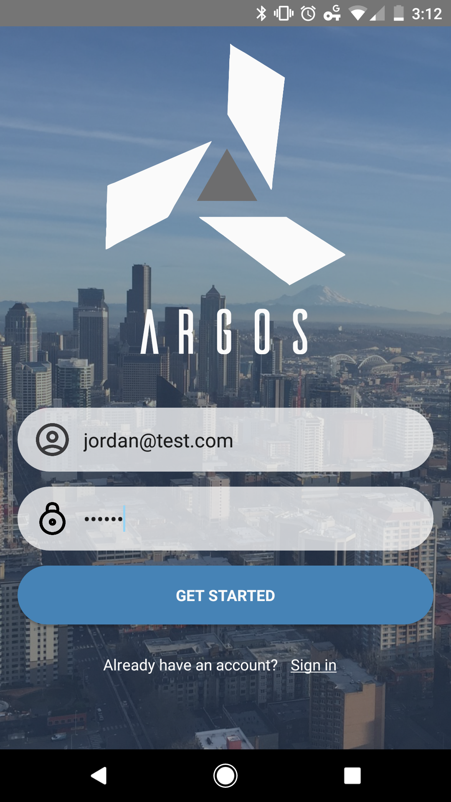
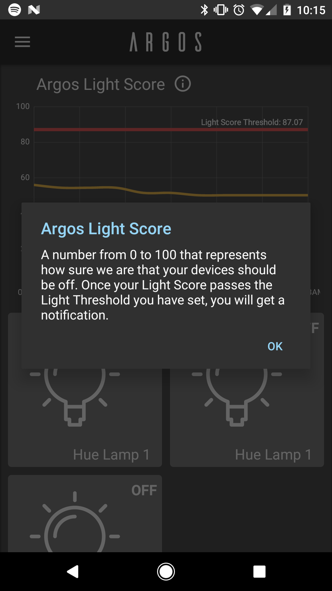
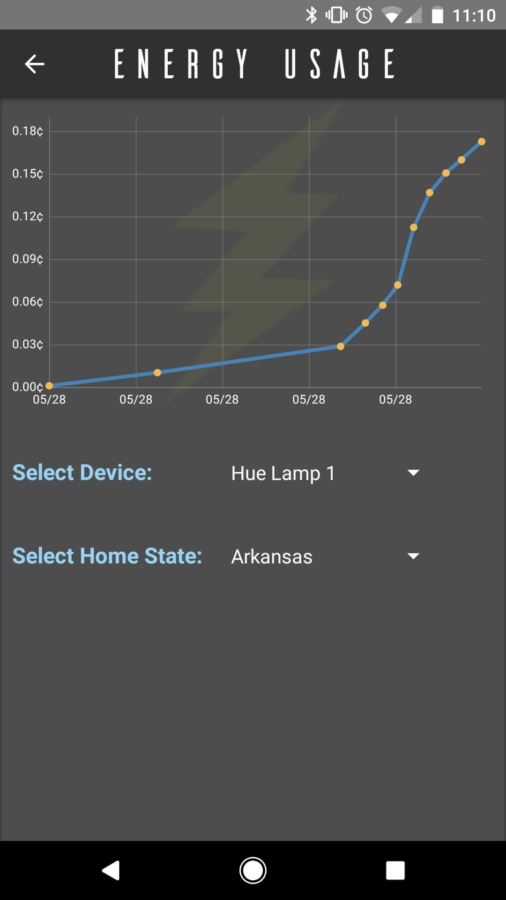

# Argos Documentation

## Table of Contents

* [About](#about)
  * [Problem](#problem)
  * [Setup](#setup)
  * [Device Support](#device-support)
* [Technologies](#technologies)
  * [Android App](#android-app)
  * [In-home hub](#in-home-hub)
  * [IoT Devices](#iot-devices)
  * [Cloud Backend](#cloud-backend)
  * [Data Scraper](#data-scraper)
* [Features](#features)
  * [Onboarding](#onboarding)
  * [Controlling devices](#controlling-devices)
  * [Fulcrum and Device Pairing](#bluetooth-low-energy-beacon)
  * [Argos Light Score and Notification Settings](#argos-light-score-and-notification-settings)
  * [Actionable Notifications](#actionable-notifications)
  * [Energy Usage](#energy-usage)
* [Other Developer Information](#other-developer-information)
  * [Hue Emulator](#hue-emulator)

## About

Argos is a system for controlling IoT devices (currently we support smart lighting). The Argos system will learn patterns in how users interact with their devices and notify the user when their device is in the wrong state.

For example, it a light is left on and the light is normally off under those conditions (i.e. user is away from home at 4:30pm) then the user will get a notification that the light is on.

### Problem

We set out to alleviate the stress associated with being forgetful. Many people leave home and worry they forgot to do something such as turn a light off or unplug a curling iron.

Our goal is to allow users to be worry-free when it comes to the state of their home. We want to take care of reminders without the user needing to explicitly set a reminder and to allow users to actually do something about it when they realize they've forgetten something.

### Setup

Our solution includes a few components. Most coordination, data storage, authentication, and other features that require access from anywhere run on our cloud-hosted [node.js server](#cloud-backend). Communication with in-home devices (getting/setting state) occurs through a [small device](#in-home-hub) that the user plugs into their in-home router. For our prototype we used a [Raspberry Pi](https://www.raspberrypi.org/) as this device. The user does all interactions through our [Android application](#android-app). This helps to hide many hardware details from the user and make the system easy to use. Finally, the user will have [supported smart devices](#device-support) in their home which they can interact with through the application.

### Device Support

This initial version of the project only supports Phillips Hue smart lighting. We chose to do this because members of our team already had access to these devices so it lowered our cost of development. We developed a simplified pluggable interfact in JavaScript to allow for developers to easily add support for other device types. Developers must add the following functionality to their JavaScript class:

* `discover()`: returns a list of discovered devices
* `isOn(device)`: Takes JSON for a devices. Returns if the device is on or notify
* `setState(device, state)`: Takes device JSON and device state (on or off)
* `getState(device)`: Takes JSON representation of a device

## Technologies

We used many different technologies in developing this system. At a high level we used: Java, Android SDK, node.js, Phillips Hue API, Heroku, and Firebase. Below are more in depth explanations of the major components of our system.

### Android App

The majority of user interaction is done through our Android app. The user can control lights, view some usage metrics (discussed in [features](#features)), manage notification settings, and recieve notifications about their home devices. Users pair their phone with the [Fulcrum hub](#in-home-hub) and can the use all features of the app anywhere (even when away from home or on a different network).

We chose to use Android for our mobile app because both of our developers have Android phones and Android development experience. A production version of this application would also need to support iPhone. It could also support optionally other platforms (web, desktop, tablet, etc).

In our GitHub repo, this code is stored in the ***android*** subdirectory.

### In-home hub

The hub, what we call the Argos Fulcrum, is a small computer that sits in your home, connected to your router. It handles communcation with IoT devices and makes requests to the [cloud backend](#cloud-backend). For our prototype, we ran this on a Raspberry Pi. Each minutes, the Fulcrum queries the state of every device in your home and reports this state to the cloud backend.

The Fulcrum also listens for commands from the backend fo changing the state of devices. When the hub powers on, it sends a request to the backend with a unique identifier (tied to the hardware) to register to the backend that it can receive commands. It also opens a [bidirectional web socket](https://pusher.com/websockets) for communcation. If it turns off for any reason it simple deregisters from the backend. When it comes back online it will register again. This means that the backend does not need to know the IP address of the Fulcrum or any other information about the device. This also means that if the Fulcrum moves to a different house/state/country it will still work the exact same.

The Fulcrum is written in node.js. We chose this language because of its ease of development. We were able to quickly write functioning code. It also has great HTTP client libraries which was important for writing a program that makes a lot of HTTP requests.

In our GitHub repo, this code is stored in the ***rpi*** subdirectory.

### Cloud Backend

Our cloud backend handles communication with both the Fulcrum and the Application. All requests are made to the backend. It then determines what needs to be done and will dispatch these requests if necessary. The App does not communicate directly with the Fulcrum so the backend routes any of those requests.

The backend also handles the machine learning aspect of our project. It uses a Naive Bayes model to predict if a device is in the incorrect state and sends notifications to the android app if so.

The backend is written in node.js using ExpressJS. We chose to use the same language for the backend and the fulcrum to make intercommunication simpler and to reduce the mental context-switching necessary when developing in both code bases. It is hosted on heroku. We chose Heroku because of its free tier and fairly strong performance. It also makes deployment and application management very simple.

In our GitHub repo, this code is stored in the ***web-api*** subdirectory.

### Data Storage

We used Google's [Firebase](https://firebase.google.com/) service for data storage. This stores device states and history as well as Fulcrum hubs and devices the user has paired to. We also used firebase services to handle push notifications to our mobile app and user registration/authentication.

We chose to use Firebase because it is very simple to use and has a generous free tier. If this project were to be picked up by another company, it would likely be simpler to move to whatever database solution that company uses. Any [document-oriented database](https://en.wikipedia.org/wiki/Document-oriented_database) would be suitable.

### IoT devices

Our system is designed to communicate with third-party smart devices. The current version communicates with Phillips Hue smart lighting (as previously indicated). Our idea is that a production release of this system would seek to integrate with other IoT providers (i.e. Samsung Smart Things, TP Link, etc).

### Data Scraper

Our Android application provides data about how much users are spending on energy consumption from their smart devices. To provide this feature we needed to scrape a government website to get data about average energy prices. To do this we wrote a small Python script to pull this data and load it into out Firebase database.

In our GitHub repo, this code is stored in the ***energyscraper*** subdirectory.

## Features

Because our project is for in-home use rather than a live site, each feature below is accompanied by screenshots and vieos to show that feature in action.

### Onboarding

When users sign up for our app they only need to provide an email address and password. This makes for a very simple sign-up process that is as easy as signing in.

### Fulcrum and Device Pairing

Device setup takes only a few minutes. To set up the fulcrum, the user simple plugs it into power and plugs it into their home router via a provided ethernet cable. Then the open their app and are prompted to go through pairing. Pairing is done through a Bluetooth Low Energy Beacon, so they user simply has to stand near the fulcrum and it will appear as an option. Then they simply tap on it to pair.

Pairing a device is just as simple. Once the fulcrum is set up, the user will be prompted to set up devices. They just need to respond to a couple prompts and they're all done.

See the GIF below to watch the whole process. In our tests, creating an account and pairing took ***under 30 seconds***. We are very proud of this accomplishment.

<!---->

In App Pairing: [Video Link](https://youtu.be/5N_Ac2cNn0A)

Hardware setup:

<!---->

Live Hardware Setup: [Video link](https://youtu.be/NvxzJDYTbS8)

### Controlling devices

Once devices are paired with the Fulcrum, users can easily see and toggle the state of their devices from the dashboard screen. Tapping on the tile turns the devices on and off. There is little-to-no delay on the device actually changing state once the tile is pressed.

<!--

  

-->

Device Toggle - In App: [Video link](https://youtu.be/PL2qi55UV1c)

Device Toggle - Live: [Video link](https://youtu.be/bLpVH5-ZmGg)

### Argos Light Score and Notification Settings

The argos light score is a number from 0 to 100 which represents how sure we are that your light should be ***off***. The light score chart on the dashboard has a red line that the user can move up and down. When the light score crosses that threshold set by that line, the user will receive a notification that their device is in the wrong state. We have also provided a small info alert that explains this concept to the user.

  <!---->
  

Argos Light Score: [Video link](https://youtu.be/uutc--WNwk4)

### Actionable Notifications

When Argos predicts that a device is in the wrong state, it will notify the user. From the notification, users can change the state of that device without opening the app.

Notifications: [Video link](https://youtu.be/9OufN6wQjyo)

### Energy Usage

As an additional feature, we also provide charts that show energy usage over time (by cost) for all devices or for individual devices based on average energy prices in your area.

## Other developer information

### Hue Emulator

For devlopment purposes we made use of the great [Hue Emulator](http://steveyo.github.io/Hue-Emulator/). It runs on the same computer that you are running the Fulcrum program on and will act just like the Hue hub with 3 lights paired to it.